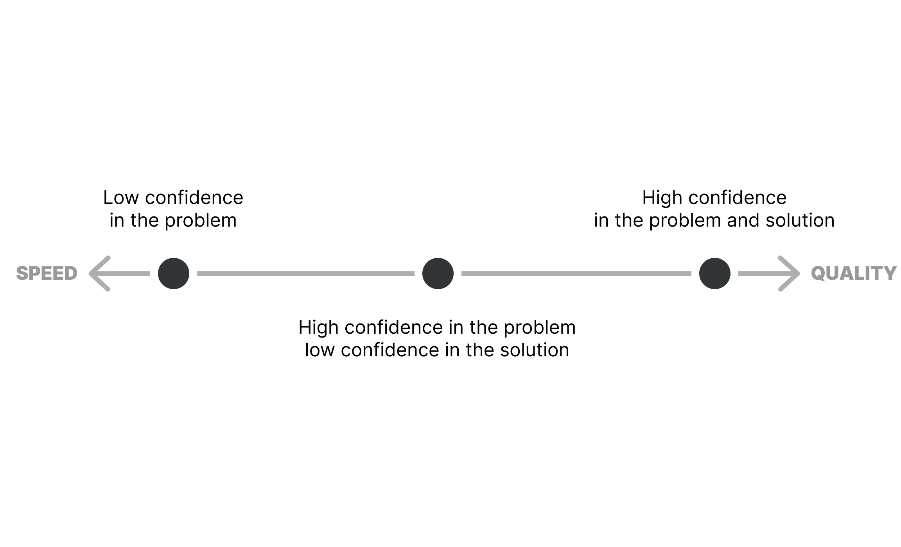

# 信心决定了效率和质量

**在开发产品时权衡效率和质量之间的关系。**

效率和质量是产品研发过程中两个重要的指标，但两者无法兼得，这个工具将帮助你找到两者的平衡点。

## 如何使用它？

你优先考虑效率还是质量应该基于你对以下方面的信心:

1. 你所解决问题的重要性
2. 上述问题解决方案的正确性

在开始之前，请确保你的信心来源于数据而不是主观感受。

有三个基本结论：

- 对问题的重要性，你的信心是否不足？专注于效率。
- 你对问题和解决方案有信心？专注于质量。
- 你对问题的重要性有信心，但对解决方案信心不足？兼顾效率和质量。

当然，信心并不是银子弹，因此，你的结论也会存在许多的细微差别。

### 资料

[《人人都能学的产品管理心智模型》作者：Brandon Chu](https://blackboxofpm.com/product-management-mental-models-for-everyone-31e7828cb50b)
