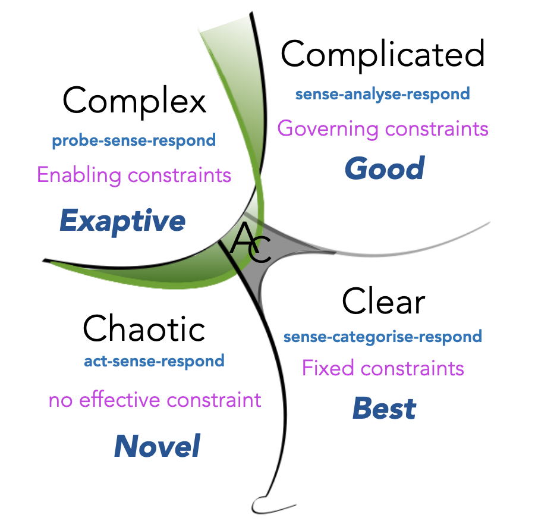

# Cynefin 框架

**基于不同的情况选择合适的应对方式。**

面对不同的情况通常需要不同的应对方式，Cynefin 框架（发音为/kəˈnɛvɪn/ - "kuh-nev-in"）是由 Dave Snowden 在 1999 年开发的，它用来帮助你了解当前的情况，并做出适合你所处情况的决定。

## 如何使用它？

---

该框架确定了五个领域来对问题或情况进行分类：清晰（Clear）、繁杂（Complicated）、复杂（Complex)、混乱（Chaotic）和一个处于中央的失序区域。

其理念是**确定你所在的领域，然后根据它的特点采取适当的措施**，让我们详细地认识下每个领域。

### 清晰

它也被称为明显（Obvious）或简单（Simple），是最佳实践的领域。在这个领域，问题是熟悉的、明确的，因果之间的关系是清晰的，情况是稳定的，许多面向过程的情况和问题都属于这个领域，这是一个 "已知的已知（known knowns） "的领域。

在这些情况下，解决方案通常是很明确的，不需要太多的专业知识。

正确的方法是 _感知（sense）- 分类（categorise）- 响应（respond）_：确定事实（感知），对其进行分类，然后采取现有规则或者最佳实践进行处理。

### 繁杂

在这个领域，可能存在多个正确的答案，但并不是立竿见影，这是一个“已知的未知（known unknowns）”领域——虽然问题很清晰，但要回答它们需要付出努力。

这就是为什么需要采用 _感知（sense）- 分析（analyze） - 响应（respond）_ 的方式来处理问题，因此通常需要结合专业知识进行分析，专家根据情况进行评估，探讨并选择合适的行动方案。

### 复杂

在这个领域，有“未知的未知（unknown unknowns）”，这种情况无法通过分析来理解，因为我们对它还不够了解，目前还不清楚首先需要解决什么问题。

因此，正确的方法是先做实验，了解问题根源，然后感知你正在处理的问题并作出适当的响应。我们的目标应该是充分理解问题或者情况，以便将问题或情况转移到更容易处理的复杂领域。

### 混乱

当事情不受控制以及因果关系不明确时，就会陷入混乱的领域。首先必须采取行动，达到稳定性，从而控制局势，只有这样才能评估情况，并努力使它具有足够的秩序，从而进入复杂领域。行动（Act）- 感知（sense）- 响应（respond）。

混乱的领域也为尝试新的解决方案提供了机会，因为在这种情况下，人们可能会拥有更加开放的心态。

### 失序

如果你不知道自己所处的位置，你便处在混乱的领域，应该迅速确定正确的领域，将问题或情况分解成多个部分，并将每个部分分配给一个特定的领域，可能会有帮助。

## 确定你所处的领域

---

最好是熟悉每个领域，从了解问题、情况的特征出发，选择合适的特定领域，下面的资料是很好的开端。

这里有一组问题，可以帮助你选择正确的领域：

- 你知道是什么导致了这种情况吗?
- 情况是否可控？
- 你对此了解多少？
- 解决这个问题需要专业知识吗?

## 加餐

---

Cynefin 框架的关键思想是：**不同的情况或问题需要不同的响应**，应该确定你正在处理哪种情况，并在这个框架的帮助下选择一个合适的领域。

### 资料

[“领导者的决策框架” ——《Harvard Business Review》](https://hbr.org/2007/11/a-leaders-framework-for-decision-making)

[“理解 Cynefin 框架” —— 《Everyday Kanban》](https://www.everydaykanban.com/2013/09/29/understanding-the-cynefin-framework/)

[维基百科上的“Cynefin 框架”](https://en.wikipedia.org/wiki/Cynefin_framework)

[Miro 上的“Cynefin 框架模板”](https://miro.com/templates/cynefin-framework/)
