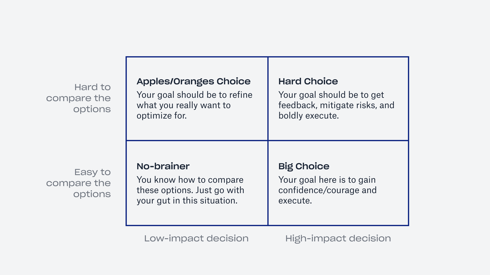

# Hard choice model

**Figure out what kind of a decision you're making.**

The hard choice model can help you see the kind of a decision you're making – whether it's a no-brainer, a hard choice or something in between. It will enable you to move forward with your decision. 

How to use it
-------------

Think about two factors of your decision:

* How impactful it is
* How easy it is to compare the options

There are four kinds of decisions that you can make. This model places them based on those two factors:

#### No-brainer

Decision with low-impact where it's easy to compare the options.

Here you can move fast and go with your gut feeling.

#### Apples/Oranges choice

Decision with low-impact where it's hard to compare the options.

You should refine your options based on what is really important to you.

#### Big choice

Decision with high-impact where it's easy to compare the options.

You need to gain confidence before making the decision.

#### Hard choice

Decision with high-impact where it's hard to compare the options.

In this case, a tool like [the decision matrix](/decision-matrix) can help you carefully evaluate options based on different factors.

### Move forward

When you can categorize your decision using this model, it will enable you to take the appropriate action.

### Sources

["Mental models for designers" by Wes O'Haire](https://dropbox.design/article/mental-models-for-designers)