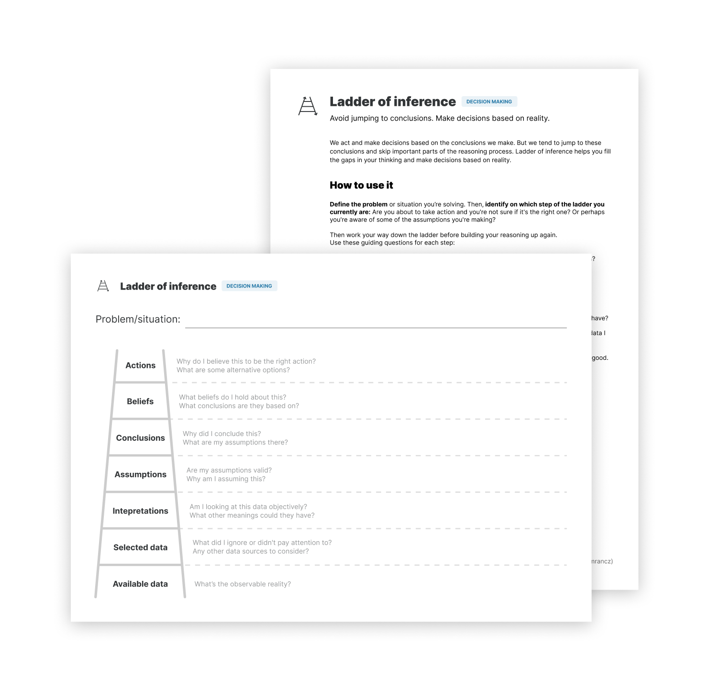

# 推论阶梯

**基于现实情况出发，避免过早下结论。**

我们根据自己的结论采取行动并做出决定，但我们倾向于直接得出这些结论，而忽略了过程中的重要部分。

由前哈佛大学教授 Chris Argyris 开发的 “推论阶梯”（Ladder of inference）是一种工具，可以帮助你填补思维中的空白，并根据现实情况做出决定。挑战别人的想法，共同得出更好的结论也是有帮助的。

阶梯
----------

There are 7 steps on the ladder that represent our mental processes. Here's what it looks like from the bottom up:
阶梯上有 7 个步骤代表我们的心理过程，下面是它从下往上看的情况：

1.  可用数据
    * 这是我们能够观察到的现实。
2.  选定数据
    * 我们根据以前的经验和现有的信念来选择我们关注的内容。我们没有足够的精力来收集每一个可用的数据，所以我们必须做出选择。
3.  解释
    * 我们给事实赋予意义，转述我们看到或听到的东西来理解它。
4.  假设
    * 基于我们的解释，我们做出了假设。
5.  结论
    * 我们从假设中得出结论。
6.  信念
    * 我们的信念是由我们得出的结论发展而来的。
7.  行动
    * 最后，我们基于信念采取行动。

这些过程通常在我们的大脑中无意识地快速发生。有意识地运用这个阶梯，可以让你退后一步，看看你从哪里得出结论。

如何使用它？
-------------

每当你对某件事情作出结论或根据你的结论作出决定时，最好停下来质疑你的推断。

首先，确定你目前处于阶梯的哪一步，你是否准备采取行动，但又不确定这么做是否正确，或许你意识到了你所做的一些假设？

然后，在再次建立起你的推理之前，沿着梯子往下走，每一步都要使用这些指导性问题：

* 行动：
    * 为什么我认为这是正确的行动？有什么其他选择吗？
* 信念：
    * 我对此持有什么看法？它们是基于什么结论？
* 结论：
    * 我为什么会得出这样的结论？我的假设是什么？
* 假设：
    * 我的假设有效吗？我为什么要这样假设？ 
* 解释：
    * 我是否客观地看待这些数据？它们还有什么其他含义？
* 选定数据：
    * 我忽略了什么或者没有注意到什么？还有其他我没有考虑到的数据来源吗？

当你回答这些问题时，你可能会发现你的推理方式发生了变化，当你到达梯子的底部时，再往上走，这一次要更有意识地、刻意地走。

例子
-------

让我们看看如何在实际的例子中应用推论阶梯。

假设我正在管理一个开发团队，最近有一个人表现不佳，他一直项目延期，有几个项目因此而被推迟了，我断定他不适合这份工作，决定解雇他。

然而，我停下来问自己，这样做正确吗？我可以运用推论阶梯来理清我的思路，也许可以做出更好的决定，我问自己一些指导性的问题：

* 为什么我认为解雇这个人是正确的选择？因为我很清楚他不适合这份工作。
* 这种信念是基于什么结论？他不是一个好的开发者。
* 我的假设是什么？我认为他最近的表现代表了他的开发水平(或缺乏开发能力)。
* 我为什么会这样假设？因为项目延期意味着他的工作效率不高。
* 我所看到的数据还有什么其他含义吗？错过项目最后期限也可能意味着最后期限设置不合理的，或者他可能需要花额外的时间来交付高质量的代码。
* 是否有其他我没有考虑的数据来源？我没有直接问他，当我这样做时，我可能会发现他一直延期的真正原因。

这是一个简单例子，但它展示了我想要避免那种草率得出的结论：_错过最后期限 → 效率低下 → 不是一个好的开发者 → 应该被解雇_。通过整理我的思路，我可以更客观地看待问题，我可能会发现发生这种情况的不同原因：也许最后期限太赶，或者他正在经历一些个人问题，这两种情况都不应该成为解雇他的理由。

影响力阶梯帮我避免了一个错误的且不成熟的决定。

实践出真知
------------------

我创建了一个简易的工作表来帮助你学会使用这个工具，它带有一个简单的操作指南，并且包含一个例子。

打印 PDF 或以数字形式填写，能够更好地理解系统：

[获取工作表](https://gumroad.com/l/untools-worksheets)

预览工作表和指南：

### 资料

[“The Fifth Discipline: The Art & Practice of The Learning Organization” 作者：Peter Senge](https://www.goodreads.com/book/show/255127.The_Fifth_Discipline)

[“Rethinking thinking” 作者：Trevor Maber](https://www.youtube.com/watch?v=KJLqOclPqis)

[系统思想家的“推论阶梯”](https://thesystemsthinker.com/the-ladder-of-inference/)