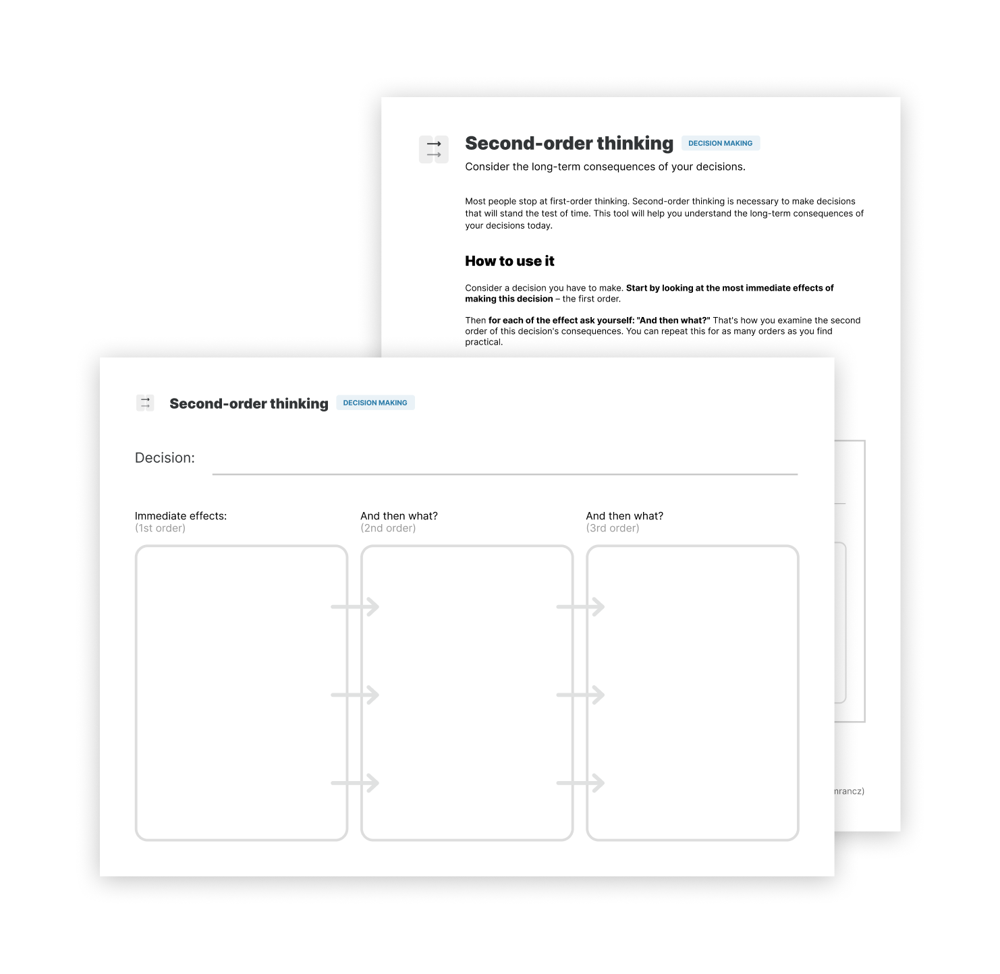

# 二阶思维

**考虑你的决定所带来的长期后果。**

随着时间的推移一些看似成功的决定其实最终会是失败的，现在看起来像是投资的东西，后面转成了负债，之前看起来是个好决定，但现在却是个坏决定。二阶思维是一种工具，可以帮助你检查你的决定所带来的长期影响。

大多数人止步于一阶思维，要做出经得起时间考验的决定，拥有二阶思维是必要的，我们需要确保能接受我们今天的决定所带来的长期后果。

如何使用它？
--------------

使用二阶思维可以是一种纯粹的脑力锻炼，也可以将它写在纸上。

考虑一个你必须要做的决定，从做这个决定的最直接影响开始——第一顺序。

接着针对每一种效果问自己：“然后呢？”这就是你如何检查这个决定的第二顺序，你可以对你认为实用的多个顺序重复这样做。

或者，在不同的时间线上考虑这个决定，问问自己：这个决定会带来产生什么样的后果

* 10 分钟？ 
* 10 个月？
* 10 年？

这样你就可以考虑到你下的决定所带来的的短期、中期和长期后果。

你可以将二阶思维应用于大的决定（如买房子），也可以应用于小的或者很平常的决定（如吃蛋糕）。这是一个非常普遍的工具，不仅与个人生活有关，而且与商业或决策有关。

二阶思维实践
---------------------------------

让我们来探索一下二阶思维是怎样的，考虑在城外买房子的决定。

直接的影响可能是拥有了一个花园，为家人提供了更多的空间，但离工作地点大概要一小时。

现在看看它们的高阶结果：

* 有一个花园 → 能够种植农产品 → 有新鲜的香草和蔬菜
* 更大的家庭空间 → 更多的房间需要打扫 → 凌乱的家带来更多的压力
* 住在离工作地一小时的地方 → 需要买一辆车 → 每天花两小时在车里

显然，这只是如此重大决定产生的小部分后果，但它表明二阶思维可以帮助你看到更长远的后果，你现在可以做出更明智和更周到的决定。

实践出真知
------------------

我创建了一个简易的工作表来帮助你学会使用这个工具，它带有一个简单的操作指南，并且包含一个例子。

打印 PDF 或以数字形式填写，能够更好地理解系统：

[获取工作表](https://gumroad.com/l/untools-worksheets)

预览工作表和指南：

### 资料

[Shane Parrish 的 《二阶思维》](https://fs.blog/2016/04/second-order-thinking/)

[Howard Marks 的 《最重要的事》](https://www.goodreads.com/book/show/10454418-the-most-important-thing)