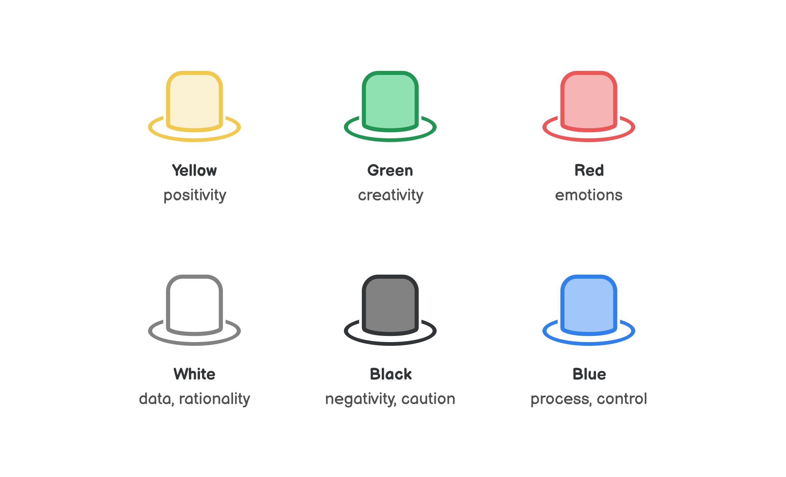

# Six Thinking Hats

**Look at a decision from different perspectives**

Making the best decisions often requires looking at them through different lenses so that you don't overlook an important aspect. Six Thinking Hats, created by Edward de Bono, is a tool for doing exactly that. You can use it for your own thinking or in a group where everyone can represent a different perspective.

How to use it
-------------

Each thinking hat represents one lens/perspective/style of thinking. Try "wearing" different hats and look at the decision through each.

If you're in a group, you can assign the hats to everyone to get a balanced discussion. Or you can go through different perspectives as a whole group.

Here's what each hat is about:

* **🟡 Yellow hat** is about **positivity**. Try seeing the benefits of this decision and what opportunities it opens.
* **🟢 Green hat** represents **creativity**. Let your mind run free and generate ideas without censoring them. Try coming up with creative options and solutions. Tools like the [Productive Thinking Model](https://untools.co/productive-thinking-model) or [First Principles](https://untools.co/first-principles) can help you.
* **🔴 Red hat** is about **emotions**. How do you feel about this? Use your intuition and gut feelings. Try to see how others might react emotionally. It's a great way to bring emotions into an otherwise rational process.
* **⚪️ White hat** makes you focus on the **data**. Analyze the available data and trends. This represents a very rational approach.
* **⚫️ Black hat** represents looking at the **downside**. What are the worst-case scenarios? Take a defensive approach, imagine any potentially negative outcomes, see what might not work. [Inversion](https://untools.co/inversion) might be a helpful tool here.
* **🔵 Blue hat** is for controlling the **process**. Especially in meetings, it's good to be able to step in when there's no progress and enable the group to move forward (e.g. by shifting the thinking or discussion to a different hat/perspective).

Example
-------

Let's see how using this tool might play out in an example scenario. Suppose you're in a management meeting to decide if you should introduce a new product to your portfolio to battle declining sales. You use the Six Thinking Hats tool to make sure the decision is considered from all possible angles.

Starting with the yellow hat, you discuss the sizable chunk of the market that this new product might cater to. It's a big opportunity for capturing a lot of revenue.

You switch to the black hat to look at possible downsides: what if the new product cannibalizes our existing products? What if it doesn't offer enough value for people to buy it?

A person wearing the white hat points out that the data you have about the market shows several unmet needs. It also shows that the declining sales of the existing products signal a trend that the market as a whole is moving to different solutions.

Wearing the yellow hat again, you see that the unmet needs in the market represent a solid opportunity and it's supported by data. Considering the possible downsides, you ask: How might we make sure the new product offers enough value?

You put on the green hat and generate ideas for how you might prototype the new product and test its value with people.

Because the meeting has been running for a while now, the facilitator wearing the blue hat suggests postponing the decision until the new product is validated with people.

The group decides to wear the red hat to do a check how everyone feels about this plan. People agree that it's a high-stakes decision and it feels right to lower the risk before making the decision. They're less anxious about it now.

In this example, the group arrived at a reasonable next step toward making this decision. Using the Six Thinking Hats, every perspective was heard and the outcome was made possible by discussing the different perspectives.

Key takeaway
------------

Six Thinking Hats is a tool that allows you to consider a decision or problem from different angles. It enables you to deliberately see aspects you might otherwise overlook, making your decision better and more resilient in the end.

If you want to find out more about the Six Thinking Hats, Edward de Bono's book with the same title is the best place.

### Sources

["Six Thinking Hats" by Edward de Bono](https://www.goodreads.com/book/show/97030.Six_Thinking_Hats)