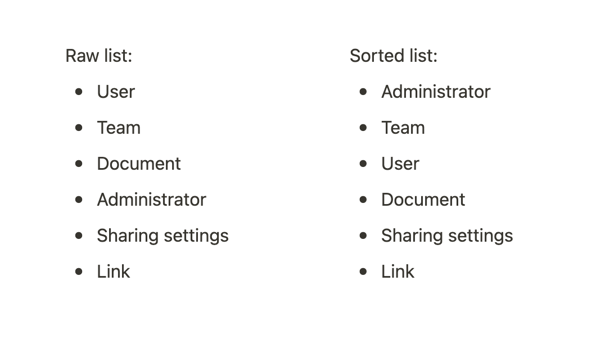
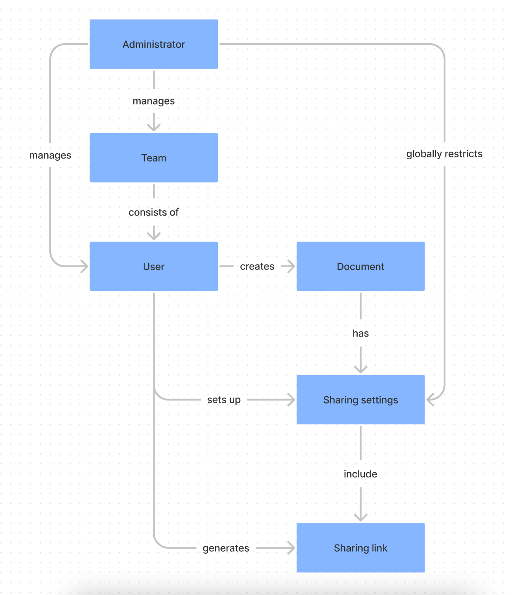

## Concept map

**Understand relationships between entities in a concept or system.**

Concept mapping is a great way to **visualise understanding of a concept or system and understand the relationships between its entities**.

It has many uses as the tool's authors, Joseph Novak and Alberto Caňas, describe:  
"_Concept mapping has been shown to help learners learn, researchers create new knowledge, administrators to better structure and manage organizations, writers to write, and evaluators assess learning_."

You can use this tool alone but it's also very useful in group workshops. In groups, it can help you find differences between how individuals understand certain concepts and find alignment.

### How to use it

Before you go ahead and create a concept map, it's important to make sure that you're in a domain of knowledge you're familiar with so the map would be accurate. It doesn't mean you need to know everything before you start creating it, but it's useful to have a good amount of starting knowledge.

#### 1\. Formulate a 'focus question'

Concept maps need context and focus questions can really help you formulate what you need to answer or use the concept map for. You can ask things like:

* How does X work?
* What's the context in which Y exists?

You'll also find that you can look at things from different angles. It's useful to find which angle specifically you want to understand: is it perhaps the inner workings of something or rather the interacting relationships around?

#### 2\. Identify key entities

Within the context of your domain or system and your focus question, identify the key entities that play a role in it: people, places, organizations, actions, processes, activities, methods etc.

Just write them down in a simple list. It's typically enough to find 15 to 25 entities but it's fine to have more if you're dealing with a complex concept.

#### 3\. Sort the list of entities

This is an intermediary step before actually creating the map. Sort your list from the most general items to the most specific ones. This will help you create a better hierarchy in your map.

#### 4\. Begin to outline the map

Write the entities on post-its and lay them out on a (virtual) whiteboard. It's important to be able to move them around as you'll be trying to capture the relationships between them.

Connect the entities with lines to visualise the relationships. Use linking verbs or phrases (e.g. "contributes to", "is made of" or "creates") to represent the relationships more specifically.

#### 5\. Continue to fill in the rest of the map

At this point, if you take two entities in a map, you should be able to read their relationship as a meaningful sentence (e.g. "Designer creates a concept map").

Try to complete the map in the same way as until now. It can take a few tries as you'll be developing better understanding of the entities and their relationships along the way.

You might identify gaps in your knowledge along the way and you'll have to fill them before continuing. That can also be a valuable outcome.

Now let's see how all of this looks like a on a simple example.

### Example

Suppose you're starting in a new role in a company that makes B2B software. You're trying to understand the product, specifically sharing permissions.

You formulate your focus question as: "How do sharing permissions work in this product?"

Then you go on to list all the entities that play a role in that and you sort the list as well:

You may find that in your case, the list can get pretty long. It's good to keep referring to your focus question to see if the items you are listing are still relevant to it.

Sorting the items is the first step toward mapping the hierarchy and relationships.

You can now begin to outline the map in a more visual way and capture the relationships. You can use a flowchart software for this or just sketch it out on paper.

With this in hand, you can now ask if your understanding is complete or if there's more to the concept. You can also start questioning how it might work better.

This is a very simplified example and some of the concept maps you'll create might be quite larger. But this should give you an idea how this thinking tool can help you.

### Takeaway

We've seen that a concept map is a very universal and useful tool for capturing and developing an understanding of concepts or systems. It makes your mental model explicit and helps you identify gaps in knowledge.

You can apply this tool to pretty much any concept and beyond the learning use-case, it can also enable you to think how something might be designed or improved.

### Sources

["The Theory Underlying Concept Maps and How to Construct and Use Them" by Joseph Novak and Alberto Caňas](http://cmap.ihmc.us/docs/theory-of-concept-maps.php#1-3)

["Exposing the Magic of Design" by Jon Kolko](https://www.goodreads.com/book/show/9634007-exposing-the-magic-of-design)