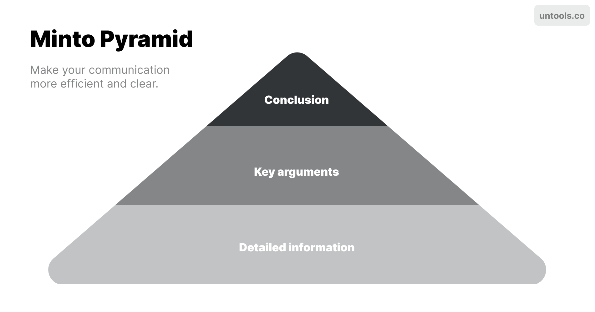
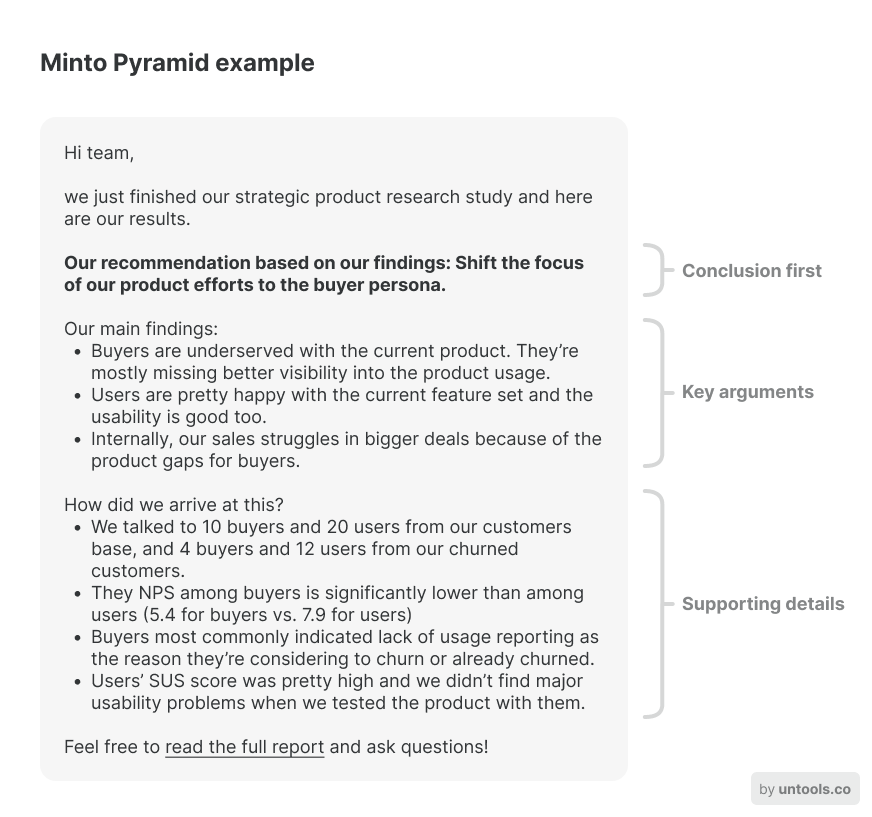

# Minto Pyramid

**Make your communication more efficient and clear.**

In business, communication needs to be clear and efficient. People are busy and don't have time to read long walls of text or listen to long presentations where the key info is shared at the very end.

Use the Minto Pyramid to give your communication a top-down structure and get your message across quickly and clearly. Lead with the conclusion, then provide key arguments and finally support them with detailed information.

### How it works

See what I did there? I shared the main takeaway with you already. That's the idea of this tool – cutting to the chase. Now let's look at it in more detail.

#### 1\. Start with the conclusion

Capture your audience's attention early on by first telling them the main takeaway, message, recommendation or simply your conclusion. This may be the opposite to how we've been taught to communicate but it's more efficient, especially in writing and with audiences who have limited time or attention.

This principle is also called BLUF – "bottom line up front". It originated in the military but is now widely used in the business world.

#### 2\. Provide key points

With the main takeaway already communicated, it's time to support it with key arguments or main points. These should still be fairly short. Write them as summaries of your main points. This part should explain the "why" behind your conclusion or recommendation.

#### 3\. Support points with detailed information

You might still need to make your key points credible. Do that by giving more detailed information that support them: facts, evidence, numbers, results. This is the part where you can really go into detail if you want to.

The busier people are, the more likely they are to skip this part but sometimes it's necessary in order for the conclusion to be accepted or acted on.

Sometimes, you might want to skip the detailed information if your key arguments are enough to justify your conclusion and you know that your audience will understand them well enough.

### Example

It's always best to see how such a tool looks like in practice. Let's see an example of a researcher who just completed a study and wants to share the results with their colleagues, along with their recommendation.

Here's how you might write a message to your team using the Minto Pyramid tool:

As you can see, there's a very clear recommendation given up front. It's explained with the key findings and those are supported by detailed data, evidence and results. This way, the audience immediately gets the most important information first. They only need to consume the details if they choose to, not in order to get to the main point.

### Takeaway

To sum up, the Minto Pyramid is a tool to give your (written) communication more clarity and efficiency. You'll lead with the conclusion, provide key arguments and support them with details. Your busy audience will thank you.

### Sources

["The Minto Pyramid Principle" by Barbara Minto](https://www.goodreads.com/book/show/33206.The_Minto_Pyramid_Principle)

["BLUF: The Military Standard That Can Make Your Writing More Powerful" by Jan-Erik Asplund](https://www.animalz.co/blog/bottom-line-up-front/)