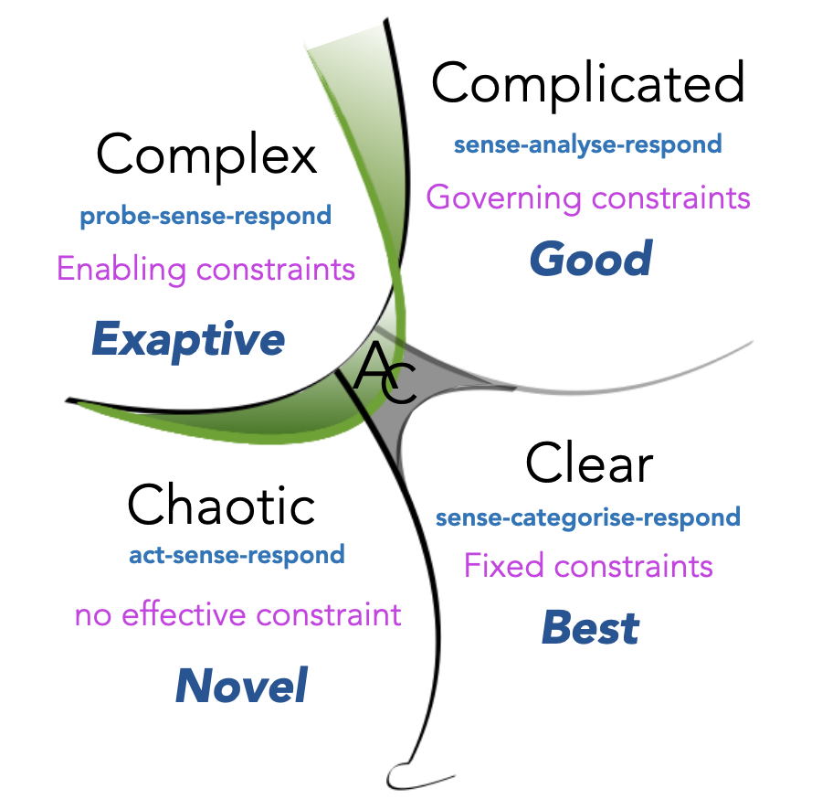

# Cynefin framework

**Make sense of different situations to choose an appropriate response.**

Different situations typically require different responses. The Cynefin framework (pronounced /kəˈnɛvɪn/ - "kuh-nev-in") is there to help you make sense of the situation in front of you and make a decision that's appropriate for the type of situation you're dealing with. It was developed by Dave Snowden in 1999. 

## How to use it
-------------

The framework identifies five domains to categorise problems or situations: clear, complicated, complex, chaotic and disorder.

The idea is to **identify which domain you're in and then choose the appropriate action based on its characteristics**. So let's look at each domain in detail.

### Clear

Also known as obvious or simple, this is the domain of best practices. This is where problems are familiar and clearly defined, cause-and-effect relationships are clear and the situations are stable. Many process-oriented situations and problems would fall into this domain. It's a domain of "known knowns".

Solutions are usually clear in these situations and don't require much expertise.  

The right approach would be _sense–categorise–respond_: understand the situation (sense), categorize it, then respond by applying a best-practice solution.

### Complicated

In this domain, there might be multiple right answers but aren't immediately visible. It's a domain of "known unknowns" – when questions are clear but it takes work to answer them.

That's why the best approach is to _sense-analyze-respond_. Because analysis is needed, the situations here typically require expert knowledge. Experts should assess the situation, investigate possible options and choose a course of action.

### Complex

In this domain, there are "unknown unknowns". The situation cannot be understood by analysis because we don't yet know enough about it. It's not clear what needs to be answered in the first place.

So the right approach is to experiment first, learn about the problem. Then sense what you're dealing with and respond appropriately. The goal should be to understand enough so that the problem or situation moves to the complicated domain where it's easier to deal with.

### Chaotic

When things aren't under control, the situation falls into the chaotic domain. It's when cause and effect relationships are unclear. Here it's necessary to first act to establish some stability, to contain the situation. Only then assess the situation and work on bringing enough order to it to move it into the complex domain. Act–sense–respond.

The chaotic domain also presents an opportunity to try novel solutions as people might be more open to them in this context.

### Disorder

If you don't know where you stand, you're in the disorder domain. The goal should be to quickly identify the right domain and move forward from there. It can be helpful to break down the problem or situation into multiple parts and assign each to a specific domain.

## Determining which domain you're in
----------------------------------

It's best to get more familiar with each domain to learn when characteristics of a problem/situation apply to a particular domain. The sources below are a good place to start.

Here's a set of questions that can also help point you to the right domain:

* Do you know what causes the situation?
* Is the situation under control?
* How much do you know about it?
* Does solving it require expert knowledge?

## Takeaway
--------

The key idea of the Cynefin framework is that **different kinds of situations or problems require different kinds of responses**. You should identify what kind of a situation you're dealing with and—with the help of this framework—choose an appropriate response.

### Sources

["A Leader's Framework for Decisions Making" on Harvard Business Review](https://hbr.org/2007/11/a-leaders-framework-for-decision-making)

["Understanding the Cynefin framework" on Everyday Kanban](https://www.everydaykanban.com/2013/09/29/understanding-the-cynefin-framework/)

["Cynefin framework" on Wikipedia](https://en.wikipedia.org/wiki/Cynefin_framework)

["Cynefin framework template" on Miro](https://miro.com/templates/cynefin-framework/)