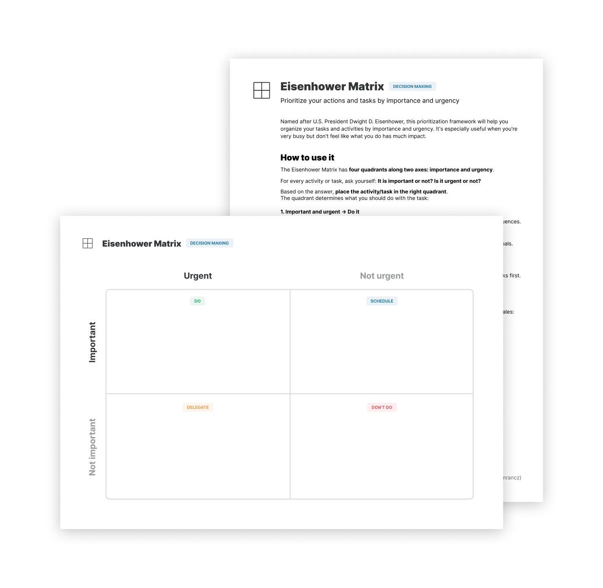

# 艾森豪威尔矩阵

**按照重要性和紧急性对你的行动和任务进行优先级排序**

以美国总统德怀特·大卫·艾森豪威尔的名字命名，这个优先级框架将帮助你按重要性和紧急性组织你的任务和活动，当你很忙但又觉得你所做的事情没有什么影响时，它就特别有用。

如何使用它？
-------------

艾森豪威尔矩阵**沿着两条轴有四个象限：重要性和紧急性**。

对于每项活动或任务，先问自己：它是重要的还是不重要的？它是紧急还是不紧急？

根据重要紧急划分，**将活动或任务分好类放在对应的象限内，象限决定了你应该对该任务做什么**。

#### 1\. 重要且紧急 → 马上执行

* 这些是你想尽快完成的任务。 
* 危机、紧急的问题和其他现在不采取行动就会带来负面后果的事情。

#### 2\. 重要但不紧急 → 制定工作计划

* 安排好时间做这些事情。
* 该象限通常是深度工作存放的位置——对你的项目或长期目标有帮助的任务。

#### 3\. 紧急但不重要 → 交由他人解决

* 如果可以的话，找一个能为你做这些工作的人。
* 如果你不能委派任务，那就自己安排好时间，但尽量先做那些重要但不紧急的任务。
* 这些通常是管理任务或有截止日期但不是关键的事情。

#### 4\. 不紧急且不重要 → 不做

* 这些任务不值得你花时间，你根本不应该做它们。
* 避开无意义的活动、忙碌的工作和娱乐都属于该象限的范畴。

这也是你任务优先级的顺序，没错，重要但不紧急的任务比紧急但不重要的任务更重要。

艾森豪威尔矩阵非常灵活，取决于你是否将其用于专业任务、个人任务或者以上两种。

你也可以在不同的时间尺度上使用它：计划你的一天与一般的生活活动的优先次序。

### 你如何区分紧急任务和重要任务？

紧急任务通常有明确的截止日期（如向客户发送草稿）或要求你及时做出回应（如电子邮件）。重要任务往往与你的长期目标相一致（如锻炼身体），并推动你的项目向前发展（如为你的副业项目写代码）。

确定紧急性和重要性始终取决于你所处的环境，以及你识别什么是真正的紧急或重要事情的能力。

例子
-------

下面是一些可能会进入艾森豪威尔矩阵的活动或者任务的例子:

|     |     |     |
| --- | --- | --- |
|     | **紧急** | **不紧急** |
| **重要** | _马上执行:_  完成到期的报告   向客户发送草稿   修复一个 bug | _时间表:_  设计一个新的功能   写一篇博客   锻炼身体 |
| **不重要** | _委托/安排在以后执行_:  购买会议门票   安排面试   回复邮件 | _不要做:_  参加一个没有议程的会议   阅读 #随意   逛社交媒体 |

加餐
--------

艾森豪威尔矩阵的宗旨是：**通过设定正确的优先级事项并付诸行动，使你更有效率**。如果你总是很忙，但在你的长期项目和目标上没有取得任何进展，这个工具绝对适合你，但它也是一个普遍有用的工具，可用于决定哪些事情要做，哪些事情要从你的生活中剔除。

实践出真知
------------------

我创建了一个简易的工作表来帮助你学会使用这个工具，它带有一个简单的操作指南，并且包含一个例子。

打印 PDF 或以数字形式填写，能够更好地理解系统：

[获取工作表](https://gumroad.com/l/untools-worksheets)

预览工作表和指南：

### 资料

[《如何使用“艾森豪威尔矩阵”提高效率，减少不必要的时间浪费》作者：James Clear](https://jamesclear.com/eisenhower-box)

[Todoist 上的“艾森豪威尔矩阵”](https://todoist.com/productivity-methods/eisenhower-matrix)