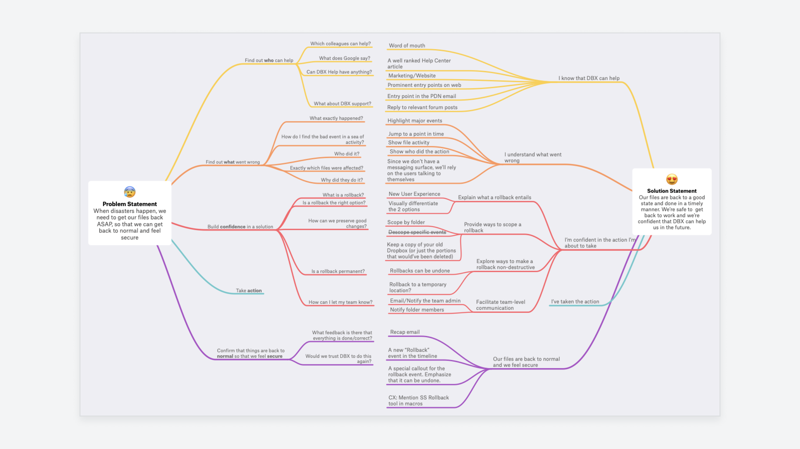

# First principles

**Break down complex problems into basic elements and create innovative solutions from there.**

Sometimes also called "reasoning from first principles", it's a powerful tool for problem-solving. Identifying the basic principles of a problem will allow you to come up with innovative solutions.

First principle is a basic principle or truth that cannot be broken down any further. First-principles thinking is about digging deeper until you arrive at the very foundations of a problem.

How to use it?
--------------

Start with your problem and take these two steps:

1.  Break it down to the most basic truths (first principles)
2.  Re-build a solution from those principles

It sounds simple but requires some focused thinking to really dig deep in the problem and discover those first principles. 

There are some techniques to help you:

### The Five Whys

This is a popular technique in user research where a researcher digs deeper by repeatedly asking "why" questions. It enables you to discover the root causes of problems. Of course, you don't have to stop at five, but it's generally enough to discover a first principle.

### Socratic questioning

A form of disciplined questioning that enables critical thinking. There are six types of questions you can ask to dig deeper for the fundamental truth:

1.  Clarification – "What do you mean by...?"
2.  Probing assumptions – "What could we assume instead?"
3.  Probing reasons/evidence – "Why do you think this is true?"
4.  Implications and consequences – "What effect would that have?"
5.  Different viewpoints – "What would be an alternative?"
6.  Questioning the original question – "What was the point of this question?"

First principles in practice
----------------------------

Let's see first-principles thinking in action. Here's a nice example from Wes O'Haire, designer at Dropbox:

"_I did this on a project last year where we started with our problem statement. From there, I broke it down into its fundamental parts, then addressed each part, and reconfigured it to build up a solution._"

### Sources

["Mental models for designers" by Wes O'Haire](https://dropbox.design/article/mental-models-for-designers)

["First Principles: The Building Blocks of True Knowledge" by Shane Parrish](https://fs.blog/2018/04/first-principles/)