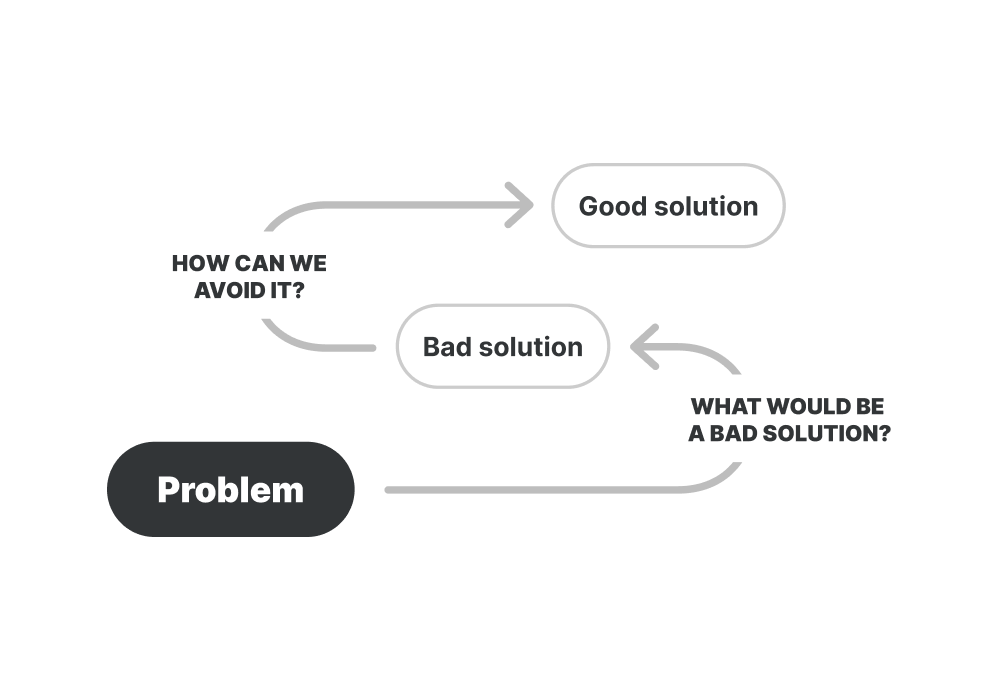

# 反转思维定势

**从不同的角度处理问题。**

当你需要从不同的角度看待你正在解决的问题时，反转思维定势是很有用的，它可以帮助你从一个不同的视角判断出最坏的情况。

如何使用它？
--------------

要知道反转思维定势是否有帮助，一个很好的触发问题的条件是：“我是否只想到理想的解决方案或场景？”

然后你可以利用反向思维去思考问题或解决方案，要做到这一点，请遵循以下步骤：

1.  问问自己：在这种情况下，最糟糕的决定/解决方案是什么？
2.  问问自己：为什么会不好？把想到的理由写下来。
3.  现在试着想出一个好的决定或解决方案，看看那些会做出错误决定的原因。

反转思维定势可以帮助你看到不好的结果，从而避免它们。

更多的问题可以帮助你看到反转思维的视角：

* 这怎么会出错呢？
* 与此相反的情况会是什么？
* 什么才是糟糕的解决方案呢？

反转思维定势实践
---------------------

项目经理在一项名为“预验收（pre-mortem）”的练习中使用了反转思维定势。 

团队聚集在一起，想象现在是 6 个月后，他们所做的项目已经失败，他们通过询问“什么地方出错了？”、“我们犯了什么错误？”或“为什么这个项目会失败？”这样的问题来研究这个潜在的情况。

这使团队提前看到了潜在的风险，并为此做好准备，通过使用反转思维定势，他们能够避免可能的错误和糟糕的结果。

### 资料

[“设计师的心理模型” 作者：Wes O'Haire](https://dropbox.design/article/mental-models-for-designers)

[James Clear 的“反转思维定势”](https://jamesclear.com/inversion)