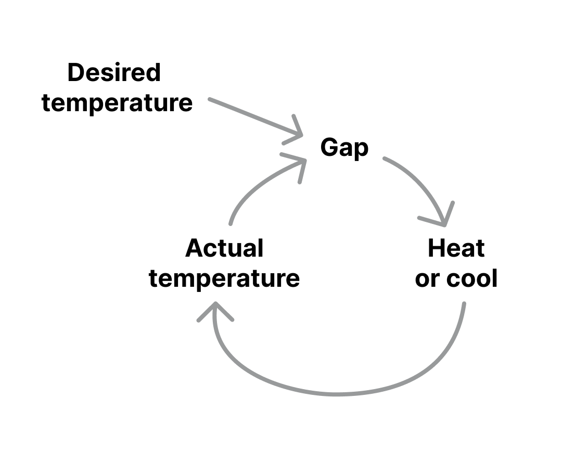

## 平衡反馈环路

**对变化进行反推以创造稳定的机制。**

平衡反馈环路是一种机制，能够阻止在一个方向上发生进一步变化，它用反方向的改变来抵消一个方向的改变。寻求系统的稳定。

通常在系统中，你会发现这种平衡循环与[强化反馈环路](./reinforcing_feedback_loop.md)相结合，而后者的作用恰恰相反，创造了指数级的变化。

平衡环是如何工作的
------------------------

平衡反馈环路有三个重要组成部分：

* 目标或期望的水平
* 实际的水平
* 两者之间的差距

当平衡环路看到一个缺口时，它将触发纠正行动，使某些东西的实际水平更接近预期水平。

了解具体的平衡循环的关键是找出它的目标，这可能并不是明确或立即可见的。

例子
-------

温控器是一个非常实用的平衡反馈环路的例子，它监测房间里的温度（实际水平），当它低于或高于某个阈值（期望水平）时，它将开始加热或冷却房间，以保持温度在阈值之内。

在这种情况下，整个循环是有意的，并设计了纠正的行为，你也会发现许多自然界的平衡循环，以茶的冷却为例，当你泡茶的时候，它会从最初的高温（实际水平）逐渐冷却，直到它达到室温（期望水平），在这种情况下，纠正措施将是茶叶和周围空气之间的热传递，这是自然发生的，没有任何意图。

加餐
--------

平衡反馈环路寻求系统的稳定，它们触发纠正行动以达到某个目标——它们是自我纠正的。

它们与[强化反馈环路](./reinforcing_feedback_loop.md)相反，后者产生指数变化。

### 资料

[“Thinking in Systems: A Primer” 作者：Donnella Meadows](https://www.goodreads.com/book/show/3828902-thinking-in-systems)

[“Visualizing the systems behind our designs” 作者：Justin Farrugia](https://uxdesign.cc/visualizing-the-systems-behind-our-designs-7a7c95b4cfb2)

[Systems Thinker 上的 “Reinforcing and Balancing loops: Building blocks of dynamic systems”](https://thesystemsthinker.com/reinforcing-and-balancing-loops-building-blocks-of-dynamic-systems/)

[Systems Thinker 上的 “Balancing loops basics”](https://thesystemsthinker.com/balancing-loop-basics/)