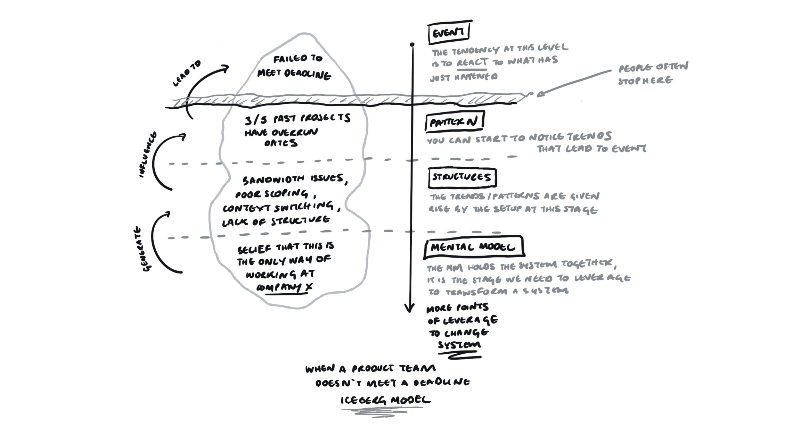
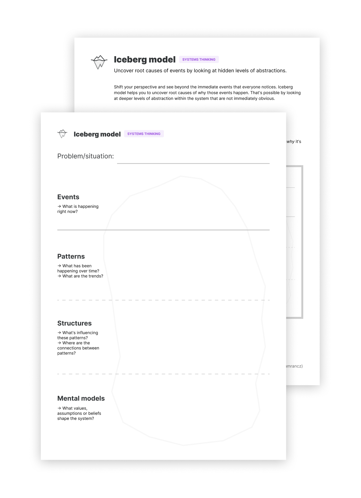

## Iceberg Model

**Uncover root causes of events by looking at hidden levels of abstractions.**

Addressing problems only on their event level is often not enough. The real causes are often hidden from plain sight.

Iceberg model is a tool that allows you to shift your perspective and see beyond the immediate events that everyone notices. It helps you to uncover root causes of why those events happen. That's possible by looking at deeper levels of abstraction within the system that are not immediately obvious.

How to use it
-------------

Iceberg model consists of four levels:

* Events
* Patterns
* Structures
* Mental models

_Example of an iceberg model by Justin Farrugia_

Looking below individual events, you can see trends over time—patterns. They are the clue for understanding the system structures that are behind those patterns. Structures are the relationships and feedback loops inside a system. These structures are in turn based on the underlying mental models of people.

Events and patterns show you _what_ is happening. Structures and mental models tell you _why_ it's happening.

The deeper you can go in the iceberg, the more leverage you'll have.

### Investigate all four levels

Here are some questions to help you understand each level within a certain problem or situation.

Events:

* What is happening right now?

Patterns:

* What has been happening over time? What are the trends? 

Structures:

* What's influencing these patterns?
* Where are the connections between patterns?

Mental models:

* What values, beliefs or assumptions shape the system?

It's important to note that answering these questions will likely require some research and digging. Especially when it comes to the mental models which are hard to document, let alone see in plain sight.

_Example of the Iceberg model by Justin Farrugia_

Example
-------

Let's look at a real-world example to better understand how the iceberg model works.

Suppose there are a couple of bugs in the feature your product team just released. That's a single event. Your instinct might be to react to it and start fixing them. That's obviously not enough if you want to prevent it from happening in the future.

If you look back in time, you see that every released feature comes with several bugs. That's a pattern. Digging deeper, you find that teams don't plan for testing before releasing a feature. The QA only happens after a release. Teams also typically have tight deadlines to ship a feature. These are structures of the system.

Investigating further, you discover that teams value shipping on time over the quality of their work. The tight deadlines are imposed by managers and teams believe it's not their place to push back.

As you can see, by looking beyond immediate events, you are able to find a root cause of a problem. You now have much more leverage for solving the problem.

Put it to practice
------------------

I created a handy worksheet to help you put this tool into practice. It comes with a simple how-to guide including an example.

Print out the PDF or fill it in digitally and use it to better understand systems:

[Get the worksheet](https://gumroad.com/l/untools-worksheets)

Preview of the worksheet and guide:

### Sources

["Connecting Systems Thinking and Action" by Ed Cunliff](https://thesystemsthinker.com/connecting-systems-thinking-and-action/)

["Visualizing the systems behind our designs" by Justin Farrugia](https://uxdesign.cc/visualizing-the-systems-behind-our-designs-7a7c95b4cfb2)