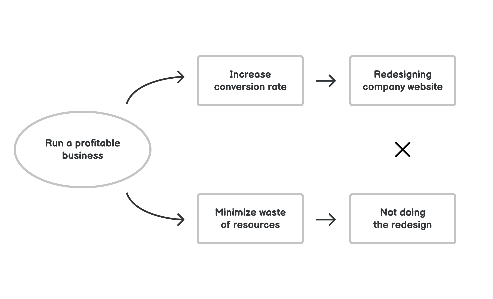
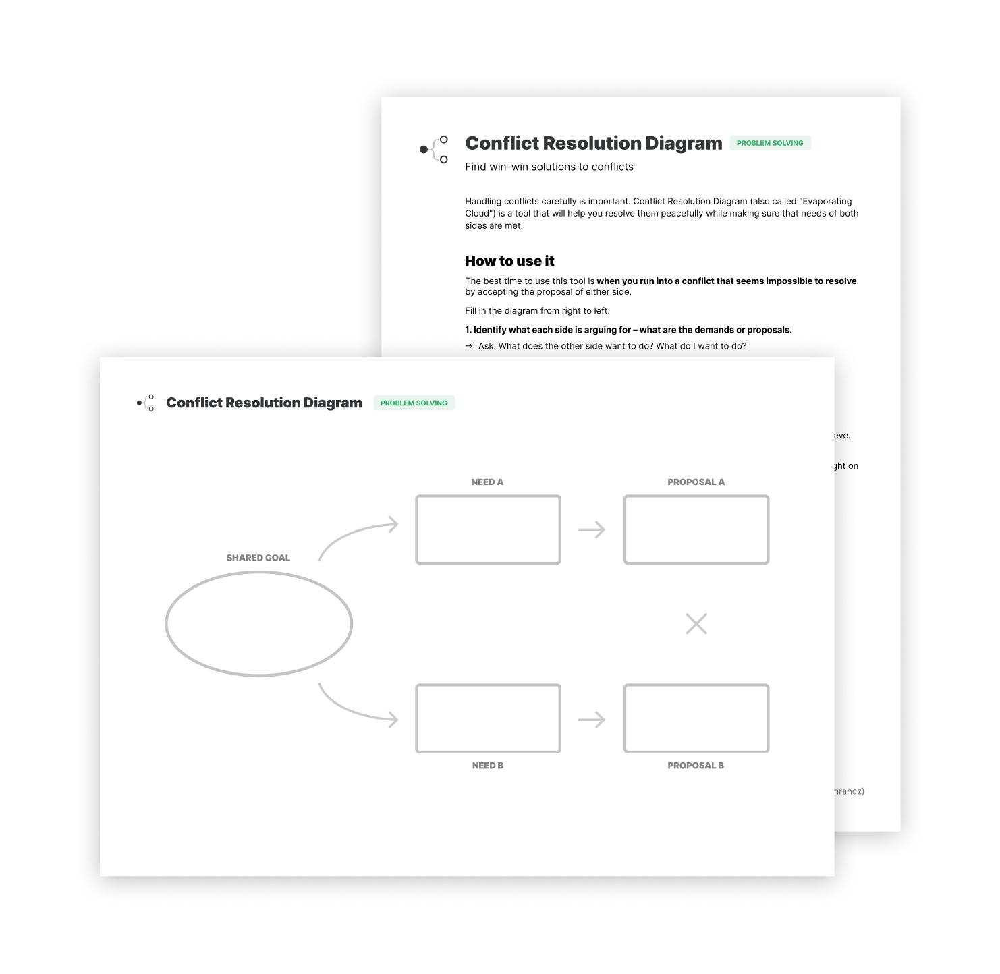

# 冲突解决图

**找到冲突的双赢解决方案**

谨慎处理冲突是很重要的，冲突解决图（也叫“消雾法”）是一个工具，它可以帮助你和平地解决冲突，同时确保双方的需求得到满足。

这是 Eliyahu Goldratt 的约束理论发展出来的思维工具之一，让我们看看它是如何工作的。

如何使用它？
-------------

使用这个工具的最佳时机是当你遇到一个冲突而它似乎不可能通过接受任何一方的建议来解决，这可能是与他人的冲突，但也可能是内部的冲突，它可以是专业的，也可以是私人的，你可以在白板上、纸上画出这个图，也可以在脑海中快速想出那个图。

这张图非常简单，由三部分组成：

* 对立双方的要求/建议：这些通常是互斥的，这就是造成冲突的原因
* 双方的基本需求或要求
* 需求背后的共同目标或目的

在这种情况下，你需要反向操作图表——从右到左。

1.  确定双方的论点是什么——要求或建议是什么。
    * 问：对方想做什么？我想做什么？
2.  明确双方立场背后的需求。
    * 问：双方的提议满足了哪些需求？
3.  找出共同的目标：
    * 问：满足双方的需求会有什么好处？
    * 这是最关键的部分，通常双方都想在更高的层次上达成一些共识，但对如何去做有不同的看法，要承认你们是在同一个团队中实现这个目标的。

确定共同的目标对于找到双赢的解决方案是必要的。

讨论原始提议背后的任何假设——这通常会揭示出导致冲突的互斥性。

从这里，你可以建立起一个新的解决方案，这一次的重点是共同的目标和满足双方的需求。

而这就是为什么冲突可以得到解决：

1.  和平的方式：寻找双方达成共识的因素。
2.  并富有成效：通过努力实现双赢的解决方案，帮助实现共同目标。

例子
-------

让我们看看如何在实践中使用它，假设你正在和同事讨论重新设计你的产品网站，而你反对这个项目，但你的同事却在推动它。你已经讨论了一个小时，但没有任何结果，为了能够继续下去，您建议创建这个冲突解决图。

首先，你写下争论的关键点：重新设计与不重新设计。 

之后，你通过讨论每一种方法到底为什么更好，来确定每种方法背后的需求。你发现你的同事需要这个网站有更好的转化率，你反对这个项目，因为你想尽量减少资源的浪费，而且你认为这样一个大项目存在很大的风险。

最后，你们一起确定通过满足这些需求，你们都想达到的目标是什么。你们发现，你们都想达到公司的财务目标，共同的目标是经营一家盈利的企业。

这是一个巨大的进步，因为现在你们有了共同的工作目标，通过利用你们的共同目标来解决冲突，并提出一个解决方案，既支持你的目标，又满足你的两个需求：例如在你的网站上运行有针对性的小型实验，这可以在不使用大量资源的情况下提高转化率。

这是一个简单的例子，展示了使用冲突解决图的巨大好处：找到双赢的解决方案。

实践出真知
------------------

我创建了一个简易的工作表来帮助你学会使用这个工具，它带有一个简单的操作指南，并且包含一个例子。

打印 PDF 或以数字形式填写，能够更好地解决问题：

[获取工作表](https://gumroad.com/l/untools-worksheets)

预览工作表和指南：

### 资料

[“逻辑思维过程”作者：H. William Dettmer](https://www.goodreads.com/book/show/2147388.The_Logical_Thinking_Process)

[Forte Labs 博客上的 “Punk Strategy Guide to The Logical Thinking Process”](https://fortelabs.co/blog/the-punk-strategy-guide-to-the-logical-thinking-process/)