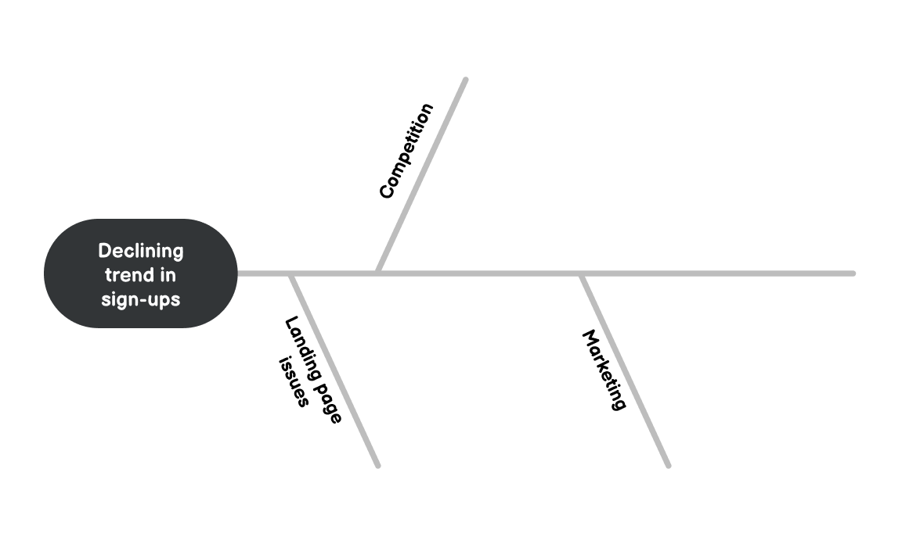
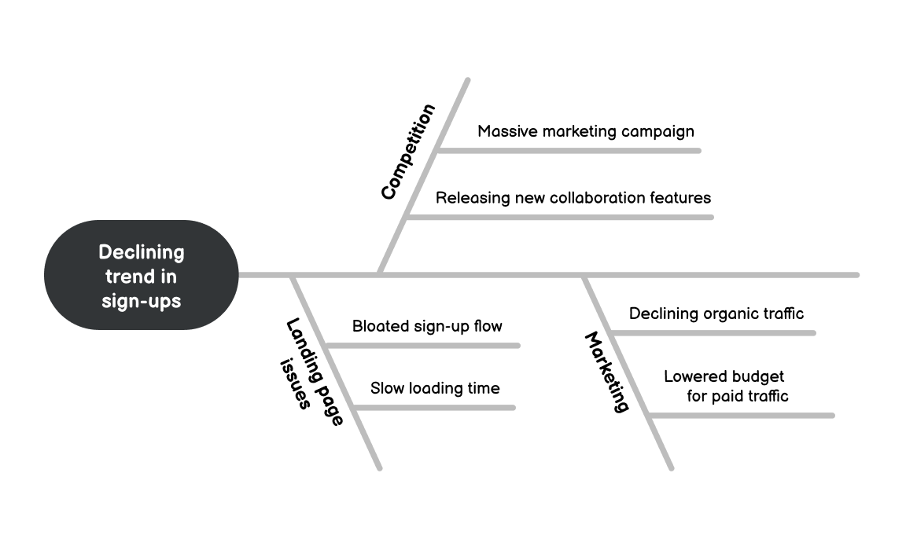

# 石川图

**找出问题的根本原因。**

石川图是一个很好的工具，可以帮助你通过识别问题的根本原因来解决问题，有时也被称为因果图或鱼骨图，它是由日本教授石川馨创造的，它对解决复杂问题特别有效。

如何使用它？
-------------

构建这个图表包含几个简单的步骤，它可以通过小组讨论来完成，也可以自己完成。

#### 1) 定义问题

首先定义问题，然后在它的左边或右边画一条线(这取决于你的偏好)。

这条线将用于在下一步添加因素。

#### 2) 确定影响因素或类别

列出可能导致你正在解决问题的因素或类别，将它们沿着主线绘制出来。

你可以提出你自己的因素，也可以使用一般类别：人（People）、设备（Equipments）、方法（Methods）、测量（Measurement）、物料（Material）和环境（Environment）。

分类对于拆解复杂的问题以及从不同角度看问题非常有帮助。

#### 3) 找到与每个因素相关的可能性根本原因

问“为什么会这样？”，将每个想法写在它所涉及的因素下面，[第一性原理](./first_principles.md)思维在这里很有用，包括“五个为什么”的方法。

请记住，问题的根本原因可能不止一个，而是多个。因此，重要的是要抓住所有可能解释问题的因素，即使只包含部分原因。

此时，您应该有一个完整的图表，但还没有确定的答案。

#### 4) 分析图表

最重要的一步是寻找所有可能的根本原因并进行分析，现在图表为你最重要的思考以及下一步行动提供了一个框架。

在这一点上，你可以做很多可能的事情，也许你可以为每个根本原因收集更多的数据或证据，或是立即确定最有可能的原因并迅速尝试解决它，这取决于你的具体问题和确定的可能原因。

例子
-------

现在让我们看看如何将其应用到实际的例子中。

假设你是一名产品经理，必须解决新注册用户越来越少的趋势，你从这个定义开始，然后确定影响因素。

在本例中，你确定了登录页面问题、竞争和营销等因素。

现在让我们找出每个因素下具体可能发生的根本原因：

写下各因素根因，你就可以开始分析问题的根源，在本例中，你可能首先验证在流量较低的情况下转化率是否稳定，然后，你可能会审计你的注册流程，找出任何存在的漏洞，并尽可能简化流程。

这是一个简单的例子，但这个图绝对适用于更复杂的问题。

结论
--------

石川图为寻找问题的根本原因提供了一个简单的框架：

1.  定义问题
2.  确定影响因素或类别
3.  找到与每个因素相关的可能性根本原因
4.  分析图表

你可以通过前三个步骤创建出图表，它将为你的分析提供一个基本框架。

### 资料

[HarvardX 的“如何创建因果图”（视频）](https://youtu.be/mLvizyDFLQ4)

[American Society for Quality 的“鱼骨图”](https://asq.org/quality-resources/fishbone)