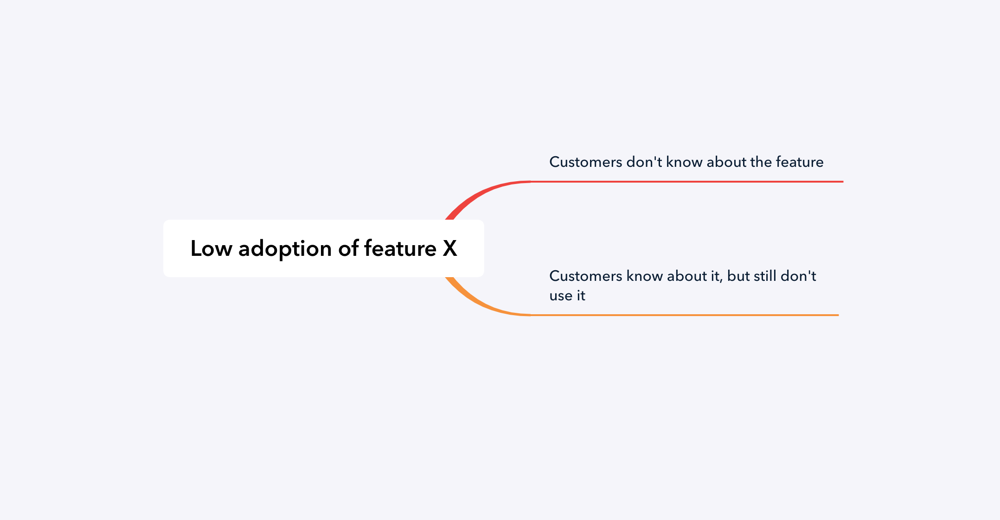
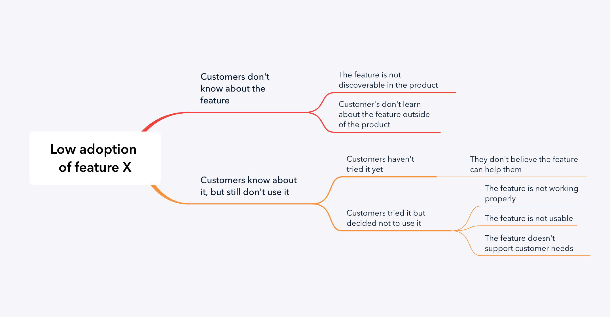

# 议题树

**以系统的方式构造和解决问题。**

议题树基本上是问题的地图，它们给你提供了一个清晰和系统的方式来看待你需要解决的问题，可以帮助你把一个大问题拆分为更小、更容易处理的问题，并对问题的某部分进行优先级排序。换句话说，它们对于“分而治之”的策略很有用。

议题树也是与他人沟通问题的好办法，因为它们提供了问题的地图。

议题树有两种基本类型：

1.  问题树——回答“为什么？”
2.  解决方案树——通过回答“如何？”来构造

如何创建议题树？
---------------------------

### 问题树

一个好的问题树必须覆盖整个问题，它必须是严格的，下面是创建问题树的一些基本原则：

1.  开始把问题拆解成不同的类别或分支。
2.  使用 MECE 原则：相互独立、完全穷尽。
    * 相互独立意味着树的不同部分之间不存在重叠，完全穷尽意味着它们涵盖了整个问题。
3.  不要纠缠于小细节（具体的假设）：重点是抓住构成问题的大类。
4.  运用二八原则：专注于问题中最有影响的那几个部分。
    * 这最好是基于数据，而不是你自己的假设。

### 解决方案树

当你挑选出问题中希望重点关注的某些特定部分后，你可以继续创建解决方案树。

1.  针对你想要关注的问题，问“我们该如何改进/修复它？”
2.  列出解决方案的潜在类别
3.  在每个类别中产生想法

这种结构化思维方式的优势在于，在约束条件下工作可以帮助你产生更多想法。

例子
-------

让我们来看一个创建议题树的例子，假设你正在开发一个产品，你看到客户没有采用你的一个关键特性，这就是树的起点。

我们将把它拆解为更小的分支，涵盖可能的原因：

* 特性功能 X 的采用率低
    * 客户不知道这个功能。
    * 客户知道该功能，但却依然不使用。

对于树的第一层，它是非常基本的，但它实际上是 MECE ——它是相互独立的，但涵盖了整个问题。

进一步扩展分支，我们最终可以得到这棵树：

* 特性功能 X 的采用率低
    * 客户不知道这个功能。
        * 该功能在产品中无法被发现
        * 客户不了解产品之外的功能
    * 客户知道该功能，但却依然不使用。
        * 客户还没有尝试过
            * 他们不相信这个功能可以帮助到他们
        * 客户尝试过，但决定不使用它
            * 该功能没法使用
            * 该功能不能正常工作
            * 该功能不支持客户的需求场景

我们可以进一步分析，但我们已经可以知道从问题的哪一部分开始，在这种情况下，关注相关的功能知识应该是优先级很高的——这个功能可能没有什么问题，只是客户不知道而已。

这是一个很好的例子，一个非常简单的议题树可以帮助你拆解分析一个问题，并提供给你一个解决问题的出发点。

结论
--------

议题树是一个很好的工具，可以通过拆解分析问题来进行系统地处理问题，你可以创建问题树（通过问“为什么？”）或解决方案树（通过问“怎么做？”），这取决于你在解决问题的过程中处于什么位置。

### 资料

[Crafting Cases 的“议题树权威指南”](https://www.craftingcases.com/issue-tree-guide/)