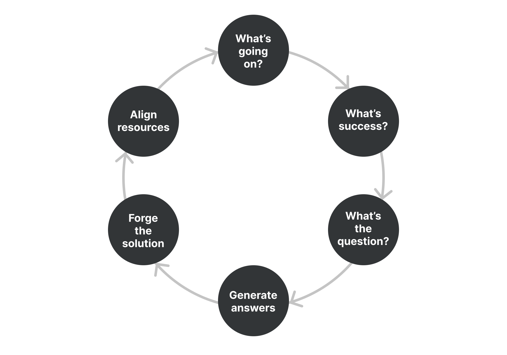

# Productive Thinking Model

**Solve problems creatively and efficiently.**

By applying more structured and critical thinking, you can understand the problem at hand better and come up with more creative solutions to it. The Productive Thinking Model, created by Tim Hurson, can help you do just that.

It's best used when a problem is already defined and you're looking for creative solutions.

How to use it
-------------

This tool gives you a 6-step framework for problem-solving. The six steps are:

1.  Ask "What's going on?"
2.  Ask "What's success?"
3.  Ask "What's the question?"
4.  Generate answers
5.  Forge the solution
6.  Align resources

Let's look at each step in more detail.

#### 1\. Ask "What's going on?"

The first step is about understanding the problem better. You can use these guiding questions to help you:

* What's the problem exactly?
* What's the impact of this problem?
* What do I already know? What information do I have?
* Who is involved in this?
* What's the vision of the future when this problem is solved?  
    _(This is what Hurson calls the "Target Future")_

Document the answers you gather here as you'll need them later in the process.

#### 2\. Ask "What's success?"

This step will help you define what success looks like in your vision of the future (that you created in the previous step).

To come up with the success criteria, you can use the **DRIVE** framework:

* What do you want the solution to **do**?
* What are the **restrictions**? What must it _not do_?
    * (_You can use_ [_inversion_](https://untools.co/inversion) _to help you here_)
* What resources can we **invest** in this?
* What **values** should the solution have?
* What are the **essential outcomes**? 

Feel free to cycle through these questions until you have a clear vision of success in front of you.

#### 3\. Ask "What's the question?"

Now it's time to generate questions that must be answered to achieve your vision (the Target Future). Hurson calls these "catalytic questions".

Use the information you've gathered in the previous steps. Phrases like "How might we...?" or "How can I...?" will help you formulate the questions.

#### 4\. Generate answers

In this step, try to come up with as many answers to the catalytic questions as you can. Brainstorm, don't judge and collect ideas. These are your potential solutions.

In the next step, you will narrow down your list of ideas to the most promising ones.

#### 5\. Forge the solution

You need to choose the best solution before developing it further. Take your list from the previous step and evaluate each idea/solution against the success criteria from step 2. Use a [decision matrix](/decision-matrix) to make this step easier.

Now you can think about building on your selected solution(s). What could make it better? How can you make it fit the success criteria more?

#### 6\. Align resources

In this final step, you move toward executing the solution.

Write down which actions and resources are necessary to make this happen. Identify people who are responsible for it – in whole as well as each part of the solution.

It's best to specify all of this in detail so that you have a clear plan of action. You should now be able to execute the solution.

Example
-------

Let's look at how this tool can be used in a practical example.

Suppose that what you're solving is winning a prospective customer.

When you probe about the situation, you find out that:

* It's a customer with difficult requirements but one that could bring in a lot of revenue.
* The impact of losing this revenue could be significant for your business.
* Your sales team has been in touch with them and know that ease of use is important for them, among other things.

Your vision (or target future) is that the customer is successfully onboarded, uses your product daily and brings in the revenue.

Let's now define success, as per step 2, using the DRIVE framework:

* What must the solution do? Show the customer the value of your product and also how well you can take care of them.
* What are the restrictions? The solution must show that we meet the customer's requirements and that the product is easy to use.
* What resources can we invest in this? We can invest two weeks of two salespeople and one week of a designer and an engineer.
* What values should the solution have?  It's convincing, transparent and thoughtful.
* What's the essential outcome? Customer agrees to sign a contract.

We can now move on to defining the "catalytic questions" that must be answered to reach our vision:

* How might we show the value of the product in a way that meets their requirements?
* How do we demonstrate the ease of use?

Let's say these are the most critical questions and we need to focus on them. We can brainstorm some answers (potential solutions):

* Present a slide deck with product and company highlights
* Build an interactive demo personalized for the customer
* Spend a day with the potential end-users and have them try the product hands-on
* Give key stakeholders a tour of the product

Now we need to choose the most promising solution. For the sake of simplicity, let's say we used the [decision matrix](/decision-matrix) and it turns out that the best solution seems to be spending a day with the potential end-users and having them try the product hands-on.

We can make this even better by inviting key stakeholders to observe so they can see the value the product can bring to their users and also that it's easy to use for them. 

The final step would be to align the resources: we will send a small team consisting of two salespeople and an engineer (to set up the product on-site) to travel to the customer for a day. The Sales VP will be responsible for coordinating this. And an engineering manager will be tasked with preparing the right version of the product for the trial.

We now have a clear plan of action for the most promising solution to the problem.

Takeaway
--------

The Productive Thinking Model enables you to solve problems creatively through structured, critical thinking. It offers a 6-step framework:

1.  Ask "What's going on?"
2.  Ask "What's success?"
3.  Ask "What's the question?"
4.  Generate answers
5.  Forge the solution
6.  Align resources

After going through these steps, you should be equipped with an action plan based on the best solution to your problem.

### Sources

["Think Better: An Innovator's Guide to Productive Thinking" by Tim Hurson](https://www.goodreads.com/book/show/1860620.Think_Better)