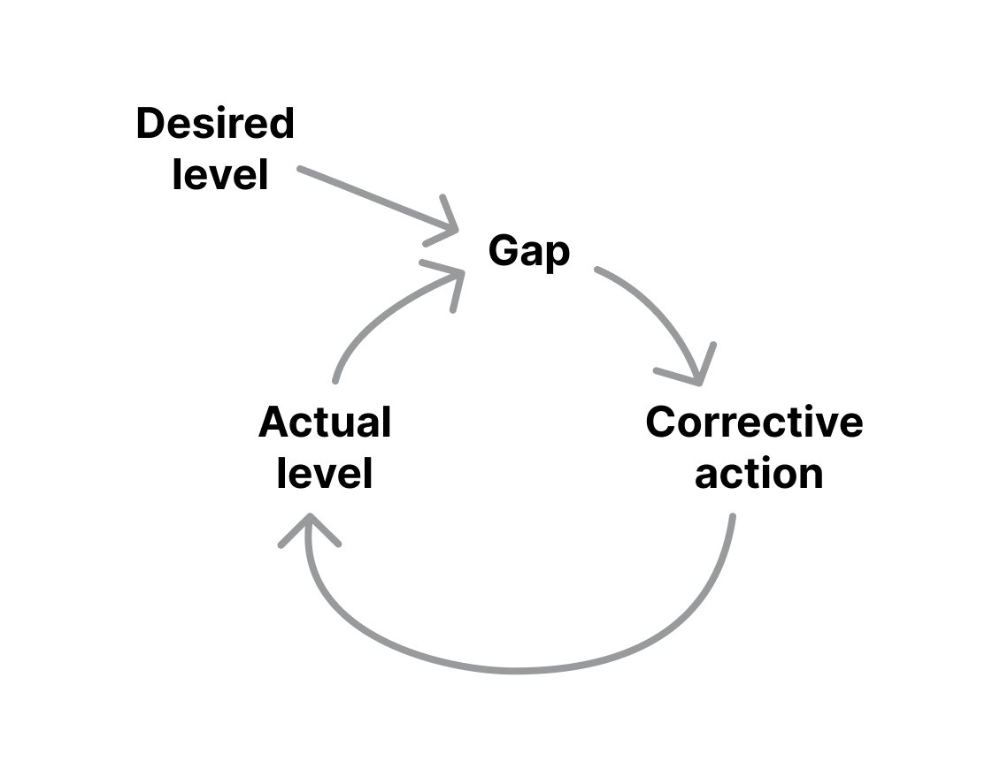
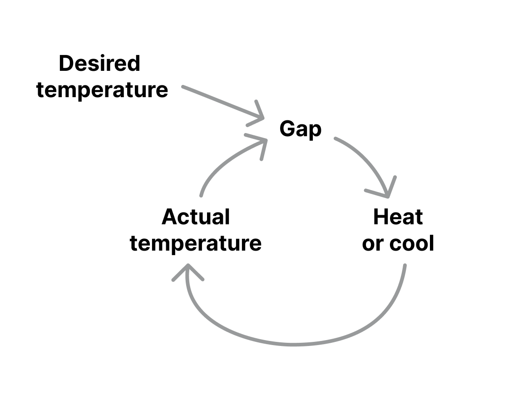

## Balancing feedback loop

**Mechanism that pushes back against a change to create stability.**

Balancing feedback loop is a mechanism that resists further changes in one direction. It counters change in one direction with a change in the opposite direction. It seeks to stabilize a system.

Often in systems, you will find this balancing loop together with the [reinforcing feedback loop](/reinforcing-feedback-loop), which does the opposite and creates exponential changes.

How balancing loops work
------------------------

Balancing feedback loops have three important components:

* the goal or desired level
* the actual level
* the gap between those two

When the balancing loop sees a gap, it will trigger corrective actions to bring the actual level of something closer to the desired level.

The key to understanding a specific balancing loop is finding out its goal. That may not always explicit or immediately visible.

Example
-------

The thermostat is a very practical example of a balancing feedback loop. It monitors the temperature in a room (the actual level) and when it goes below or above a certain threshold (the desired level), it will start to heat or cool the room to keep the temperature within the thresholds.

In this case, the whole loop is intentional and the corrective action is designed. You will also find many natural balancing loops. Take the cooling of tea for example. When you make tea and leave it be, it will gradually cool down from its initially high temperature (the actual level) until it reaches the room temperature (the desired level). In this case, the corrective action would be the heat transfer between the tea and the air around. This will happen naturally, there's no intention behind it.

Takeaway
--------

Balancing feedback loops seek to stabilize systems. They trigger corrective actions to reach a certain goal – they're self-correcting.

They are the opposite of the [reinforcing feedback loops](/reinforcing-feedback-loop), which produce exponential changes.

### Sources

["Thinking in Systems: A Primer" by Donnella Meadows](https://www.goodreads.com/book/show/3828902-thinking-in-systems)

["Visualizing the systems behind our designs" by Justin Farrugia](https://uxdesign.cc/visualizing-the-systems-behind-our-designs-7a7c95b4cfb2)

["Reinforcing and Balancing loops: Building blocks of dynamic systems" on Systems Thinker](https://thesystemsthinker.com/reinforcing-and-balancing-loops-building-blocks-of-dynamic-systems/)

["Balancing loops basics" on Systems Thinker](https://thesystemsthinker.com/balancing-loop-basics/)