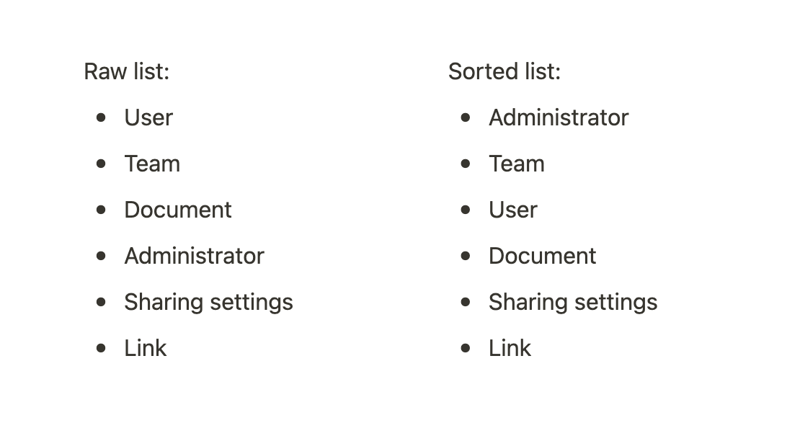
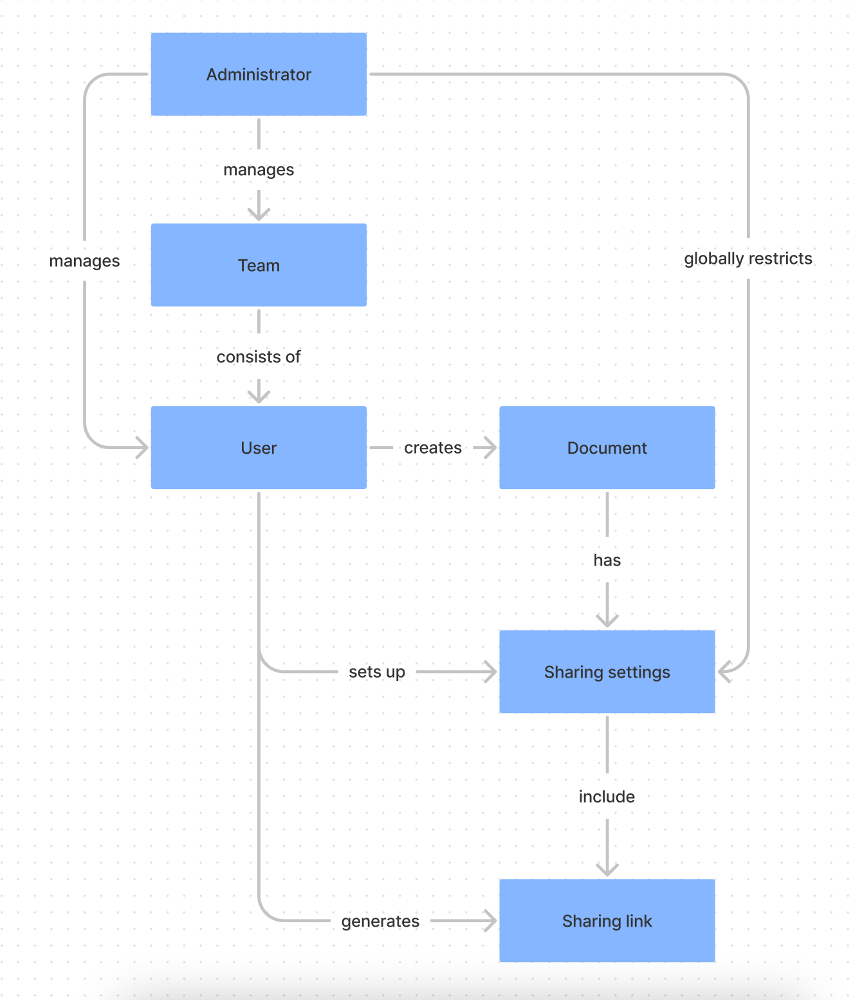

## 概念图

**理解一个概念或系统中实体之间的关系**

概念图是**可视化理解一个概念或系统并理解其实体之间关系**的好方法。

正如该工具的作者 Joseph Novak 和 Alberto Caňas 所描述的那样，它有很多用途:
“_概念图已被证明可以帮助学习者学习，研究人员创造新知识，管理人员更好地管理组织，作家写作，以及评估者评估学习_。”

你可以单独使用这个工具，但它在小组研讨会中也非常有用，在团队中，它可以帮助你发现他人对某些概念理解上的差异，并达到理解上的一致性。

### 如何使用它？

在你开始构建概念图之前，确保在一个你所熟悉的知识领域，这样地图才会准确，这并不意味着你需要在开始创建之前了解所有的知识点，但拥有大量的基础知识是很有用的。

#### 1\. 制定一个“核心问题”

概念图需要背景，核心问题可以帮助你明确需要回答或使用概念图的目的，你可以问这样的问题：

* X 是如何工作的？
* Y 存在的背景是什么？

你还会发现可以从不同的角度看问题，找出具体想要了解的角度是很有用的：可能是某种物体的内部运作，或是周围的相互关系？

#### 2\. 识别关键实体

在你的领域或系统以及你的核心问题的背景下，确定在其中发挥作用的关键实体：人、地点、组织、行动、过程、活动、方法等。

把它们写在一个简单的列表里，通常情况下，找到 15-25 个实体就足够了，但如果你处理的是一个复杂概念，多一点实体也没关系。

#### 3\. 对实体列表进行排序

这是实际创建地图之前的中间步骤，从最普通到最具体的实体项进行排序，这将帮助你在地图中创建更好的层次结构。

#### 4\. 开始画地图的轮廓

把实体写在便利贴上，并把它们放在（虚拟的）白板上，重要的是能够移动它们，因为你可以观察它们之间的关系。

用线条将实体间连接起来，使其关系可视化，使用连接动词或短语（如“有助于”、“由……所组成”或“创造”）来更具体地表示这些关系。

#### 5\. 继续填充地图的其余部分

在这一点上，如果你在一个地图上存在两个实体，你能够把它们的关系读成一个有意义的句子（例如：“设计师创建了一个概念图”）。

试着用和现在一样的方式完成地图，这可能需要几次尝试，因为你将在此过程中更好地理解实体及其它们之间的关系。

在学习的过程中，你可能会发现知识上的盲区，在继续前你必须把这些空白补上，这也可能是一个有价值的结果。

现在让我们看看在一个简单的例子中这些看起来是怎样的。

### 例子

假如你开始在一家 B2B 软件公司担任新职务，正在尝试理解产品，特别是共享权限。

你把核心问题拟定为：“共享权限如何在此产品中工作？”

然后继续列出所有在其中发挥作用的实体，并对列表进行排序：

你可能会发现这个清单可能会变得相当长，但不断基于核心问题出发，看看所列举的项目是否仍然与之相关，这看起来很重要。

对子项进行排序是映射层次结构和关系的第一步。

现在你可以开始以更直观的方式绘制地图，并描述其中的关系，你可以使用流程图软件来做，或者直接在纸上画出草图。

有了这些，你现在可以问自己是否完全理解，或者是否有更多的概念，你也可以开始质疑它如何能更好地工作。

这是一个非常简化的例子，你创建的部分概念图可能会相当庞大，但这应该会让你知道这个思维工具是如何帮助你的。

### 加餐

我们已经看到，概念图是一个非常普遍且有用的工具，用于获取和发展对概念或系统的理解，它能够使你的思维模式清晰，并能帮助你识别到知识的盲区。

你可以将该工具应用到几乎任何概念中，除了学习用例之外，它还可以让你思考如何设计或改进某件事。

### 资料

[“The Theory Underlying Concept Maps and How to Construct and Use Them” 作者：Joseph Novak and Alberto Caňas](http://cmap.ihmc.us/docs/theory-of-concept-maps.php#1-3)

[“Exposing the Magic of Design” 作者：Jon Kolko](https://www.goodreads.com/book/show/9634007-exposing-the-magic-of-design)